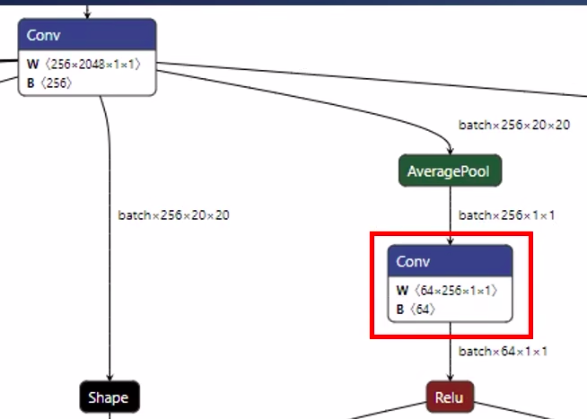
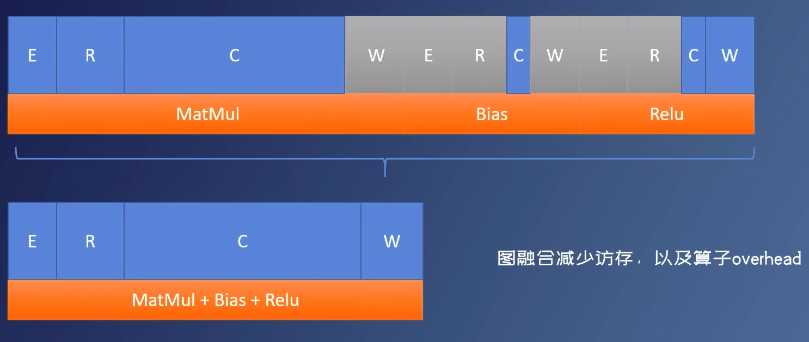
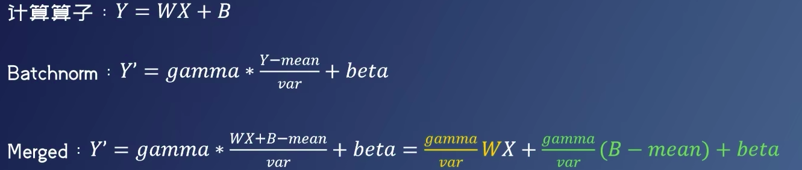
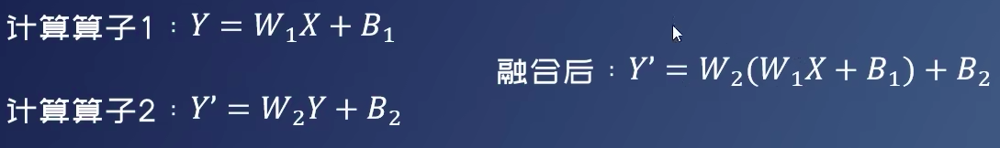
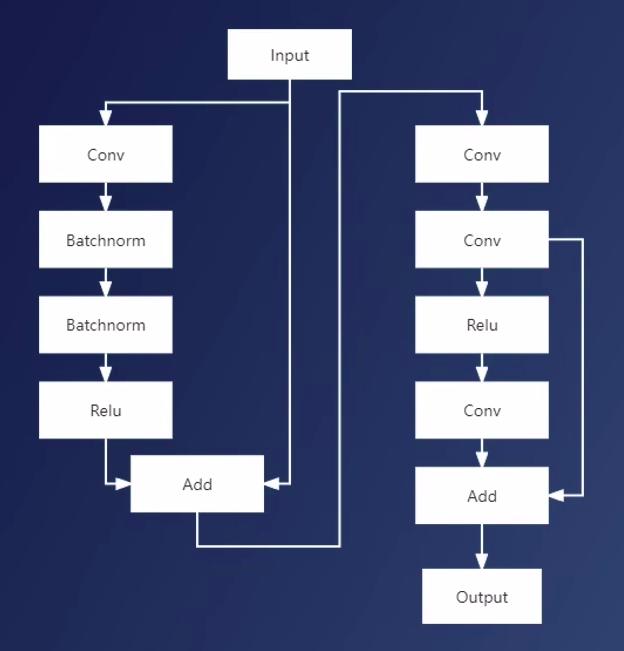
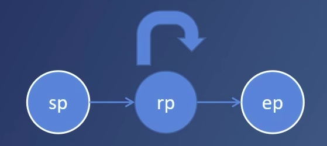
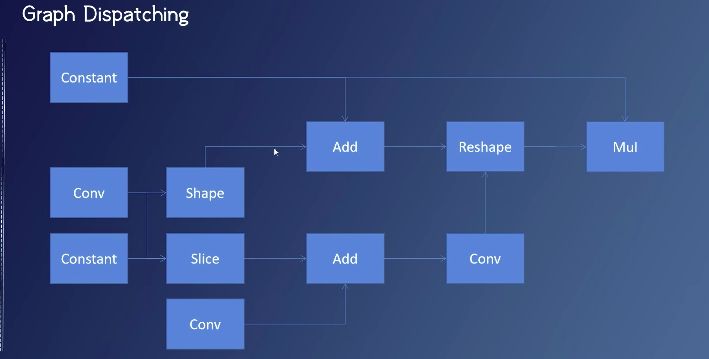

# Computational Graph 计算图
+ 有向联通无环图，其中节点为算子
+ 算子必定有边相连，输入、输出边不为空
+ 计算图可以有重边，有可能代码过不了！


算子Operators
> 最小调度单位。一个复杂的算子可以被拆分为简单算子。 例如：`Gemm=Matmul+Bias`
> 
**网络中应该尽量避免特殊算子**
## 图融合加速
> 原因：异构运算中，每个任务启动时间较长，
> + 合并后启动时间减少
> + 同时减少访存，以及overhead（开销，额外负担）
> 
> 
```c
void MatMul(
    ELEMENT_TYPE** intput,ELEMEN_TYPE** weight,ELEMEN_TYPE* bias,
    ELEMEN_TYPE** output,const unsigned int num_of_elements){
           for (unsigned int i=0;i<num_of_elements;i+=4){
             for(unsigned int j=0;j<num_of_elements;j+=4){
                 int accumulator =0;  //寄存器内
                for (unsigned int k=0;k<num_of_elements;k+=1){
                    accumulator += input[i][k]*weight[k][j];
                }
                //寄存器内完成！！
                outpuut[i][j]=accumulator+bias[j]>0? accumulator+bias[j]:0;
               
            }
        }
    }
```
#### 激活函数融合
> 计算算子:Conv ConvTranpose Gemm
> 激活函数：Relu Clip(Relu6) PRelu ..
> 
实现：`output[][]=activate_fn(accumulator+bias[]);`
整个实现在寄存器内完成。
#### 常量折叠
> 计算算子+Batchnorm=Computing Op(计算算子)

#### 矩阵乘融合
>两个相邻的矩阵乘算子（Gemm Conv）
> 
> 无限的融合无限的拆解
> 
### 例子

### 联合定点
描述一个数据流如何被量化
```c
class TensorQuantizationConfig(Serializable):
        policy # 对称 非对称
        num_of_bits
        scale
        offset
        state
        rounding 
        quant_min # 截断值
        quant_max
        self  # 父子连接 （中间结果不需要量化）
```
## 算子调度（Dispatch)与模式匹配
+ 算子调度
算子调度：把一些算子调度到不同的的平台上，可能不进行量化。
通过调度修误差 --> 手动解除量化 `setting.dispatching_table.append('conv_112',TargetPlatform.FP32)`
总能把表现不太好的算子调度回到FP32。精度和速度的平衡。

+ 模式匹配
一个计算图可以表示为节点、边集、输入、输出边组成四元组C={N,E,I,O}
需要在计算图中寻找指定结构-->? 量化算法、算子融合、算子调度
  + Swish算子图融合
  + 算子调度

  + 遍历模式匹配
 ```c
    forward_matchings= search_engine(TraversalCommand(
        sp_expr=lambda x:...,匹配起点表达式
        rp_expr=lambda x,y:....,匹配中继点表达式 relay point expression
        ep_expr=lambda x:...,匹配终点表达式
        direction='down'
    ))
 ```
**自动机**

 
> 为了执行模式匹配，需要逐步将图拆解成树，再到琏。在琏上执行模式匹配，利用动态规划进行优化

### 哪些可以量化

### 调度争议
### 调度约束
### 手动调度
layer分析后，误差大的送进FP32，是精度和速度的平衡。不能量化就保持浮点型