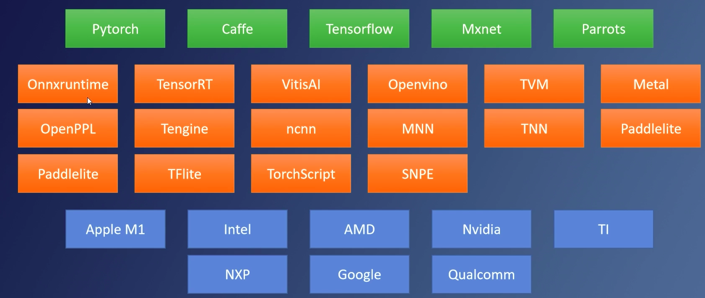

# 神经网络的部署
+ Program Runtime 运行时是程序提供的**代码库**，调用运行时访问系统资源
  + Program
  + Runtime (利用API 调用系统资源)
  + Operating System
  + Hardware
+ CRT & C++ Standard 
+ Nerual Network Runtime
  + 网络的表示问题仍然没有得到解决
    + 算法工程师喜欢排列组合
    + 各大厂制作自己的标准，标准不统一

    各大框架
    
  硬件：NXP，恩字谱半导体
## Depoly 

建议：
 + 确保网络可以被Onnx识别
 + 学会自定义算子，以及自定义的推理实现
 + 避免使用一些小trick，避免破坏图优化
 + 神经网络跑多块时**Runtime**
 + Onnx Simplifier
 + 写一个固定的 batchSize

> onnx 是种标准 ，执行是runtime 的事情。
> onnx 支持描述多种量化方案，多种量化标准，例如tensorRT标准
> 量化方案 `QUANT_PLATFROM=TargetPlatform.PPL_CUDA_INT8` 决定
> ==onnxruntime 执行会很慢==

# TensorRT部署
## GPGPU
通用图形处理器
+ 着色器渲染3D模型
+ 用户可编辑的并行循环计算
+ FPS
加速原因
  + 算子融图，较少overhead
  + 
###  后量化

==确认计算量是延迟的核心==

##  算子的执行效率
CPU 计算调用函数，只需要压  计算量小时计算效率高
GPU 计算量大效率高
+ 提升算子效率：
  + 减少算子数量，提高计算密集程度，提高计算量来提高计算效率
  + 保证网络连贯。连贯量化区
  + 网络设计不能破化图融合
  + 量化插入不能破坏如融合
### Tensor对齐
> Tensor中 CHW 所有参数都要对其（最好时16的倍数 int8是32的倍数）
若不为32倍数，kernel执行时自动对齐到32
### Nsight 分析工具

### Custimized Plugin 自定义算子

# github仓库
https://github.com/openppl-public
