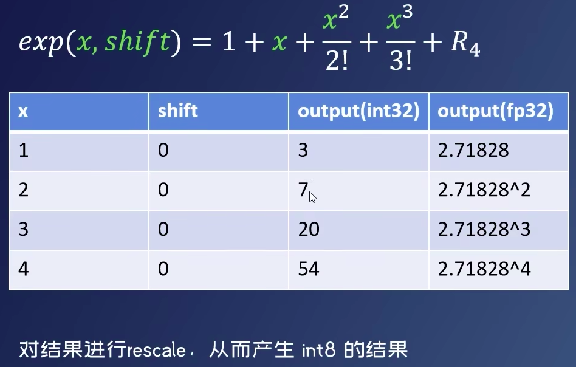

## 量化非线性运算
"量化非线性运算\n",
"Exp Tanh Sigmoid Sofemax Swish Resize 内部包含非线性运算，不可以直接量化"

+ 泰勒展开拟合，对结果进行rescale 产生8bit量化结果!
  + 显性拟合，不太好模拟
   + 推荐查表
   + 口诀 
     + 量化计算量化算，中间结果精度高。（量化后，核心计算一定是量化算子）
     + 中间算完转尺度，转弯尺度取整数。（中间结果32bit，也要转为目标）
     + 加法减法不能转，被动算子也一样。（被动算子要一致）
     + 非线性函数查表算，不然你就等死把
+ 